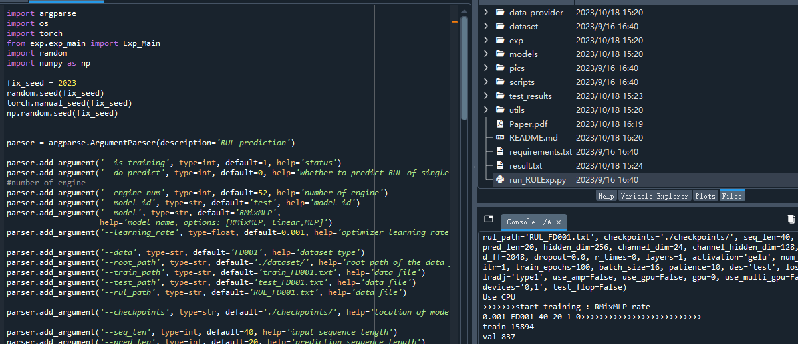
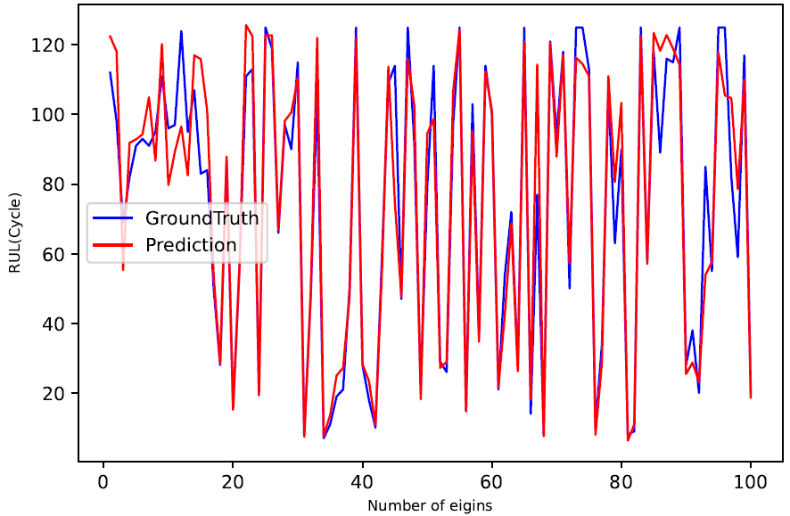

# Predicting the remaining lifespan of engines based on All-MLP machine learning models (dataset: C-MAPSS turbofan engine simulation data, Python)

The integrated environment used in this project is WinPython with Spyder IDE. The zip file contains both the dataset and code, as well as references to relevant literature.
1. All code has been tested and found to be functional.
2. Please read the project introduction carefully before purchasing, as it involves different programming languages (Python or MATLAB).
3. As a special product, once sold, there is no return policy. If you have any issues, please contact us in a timely manner.
5. No explanations for this code are provided.
The required modules include:
- numpy
- matplotlib
- pandas
- scikit-learn
- torch==2.0.0
The following arguments are added to the parser:
- --is_training: specifies whether the model is trained or not (default: 1)
- --do_predict: determines whether to predict the RUL of a single engine (default: 0)
- --engine_num: specifies the number of engines (default: 52)
- --model_id: specifies the ID of the model (default: 'test')
- --model: specifies the type of model (options: [RMixMLP, Linear, MLP]) (default: 'RMixMLP')
- --learning_rate: sets the optimizer's learning rate (default: 0.001)
Note that the code does not contain explanations for the mentioned modules or their functions, as requested.

## Image

Here is a pay link on Stripe ( https://buy.stripe.com/3cs8yP7sY87d0vu9AB ). Please contact me lonlonago@foxmail.com after funding $89, and I will send you a complete data files , thank you!

